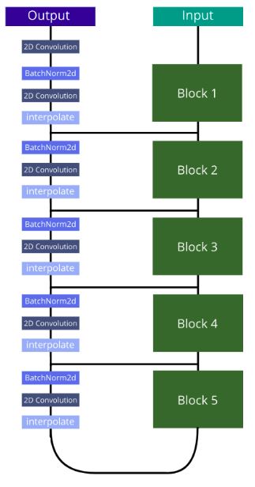
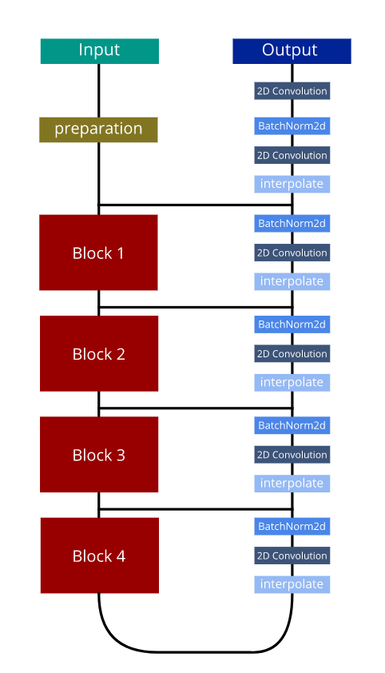
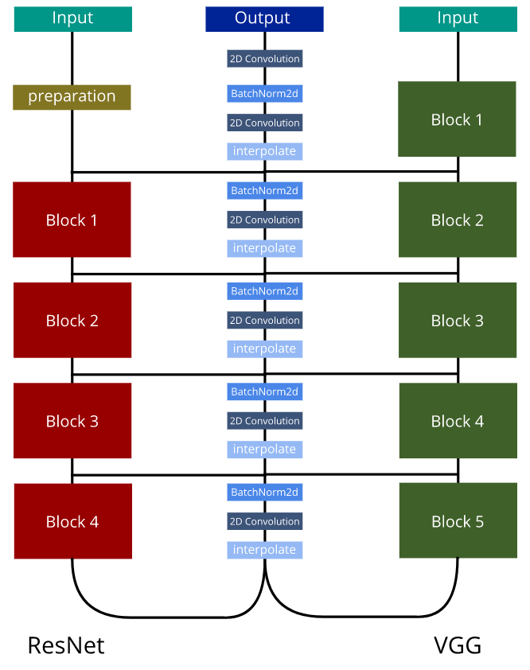

# VRCNet-Pytorch

Implementation of the paper "Singing Voice Separation using U-Net based architectures".

## Dataset

This repository uses **musdb** dataset for training and evaluation. The dataset is free, but requires access. For downloading and for further usage of the dataset check [this](https://zenodo.org/record/1117372#.XQlP9bpfg3E) webpage.

## Models

Models presented here are based on [UNet](https://arxiv.org/abs/1505.04597) architecture. The main difference is the encoding layer. For VggUNet, the encoding layer is the encoding part of VGG16, ResUNet uses encoding part of ResNet18 andn VRCNet uses both encoding layers of VGG16 and ResNet18 simultaneously. The diagram below summarizes all three models: VggUNet, ResUNet and VRCNet (from left to right).

  

## Preparation

The repository is constomized on **musdb** dataset and requires it to be downloaded and saved in a convenient folder. It is also needed to do preprocessing, as reading the audio files in each iteration may require huge amount of time. During the preprocess step, audio files are cutted into 2 second parts (by default, but can be changed), resampled if needed, passed through short-time Fourier transform and saved as an .h5 file. For preparing dataset, it is needed to call

`python3 run.py preprocess  -d *DatasetPath* -s *train/test* -o *ProcessedDatasetPath*`

`-d [REQUIRED] parameter specifies the extracted musdb dataset path with train and test folders in it`

`-s [REQUIRED] parameter specifies the subset of the dataset to be processed, i.e train or test`

`-o [REQUIRED] parameter sepcifies the folder, where processed .h5 files will be saved`

`-p -> csv file path that should be generated that will point to the processed files. Default is ./processed_dataset.csv`

There are also some optional parameters that change default values of short-time Fourier transform, as well as slice duration during preparation. For more information about the parameters use:

`python3 run.py preprocess -h`

For training, it is required to prepare train subset. Validation (i.e. test) subset is not required and can be omitted. 

## Training

For training, the csv file generated during Preparation step is mandatory.

`./run.py train -d *CSVPath* -v *ValidCSVPath* --model_name=*ModelName* --model_weight_name=*SaveModelAs* --batch_size=*SizeOfTheBatch* -e *NumberOfEpochs* --train_info_file=*LogPath*`

`-d [REQUIRED] csv file generated from preparation step`

`-v -> csv file generated for validation set during preparation step. This is NOT required.`

`--model_name -> specifies the model to be used during training. Available SCUNet, VggUNet, ResUNet, VRCNet, VCNet. Default is SCUNet.`

`--model_weight_name -> specifies name of the file where model weights will be saved. During the training, best model will be saved in "incomplete_*SaveModelAs*" file, and if KeyboardInterrupt is caught, the current best state will be saved in "interrupted_*SaveModelAs*" file. Default is model_weights.pt.`

`--batch_size -> specifies batch size during the training. Default is 1.`

`-e -> specifies number of epochs to be trained. Default is 15. `

`--train_info_file -> specifies log file of the training, where some info about the training are stored `

There are also some optional parameters. For more information about training parameters use:

`python3 run.py train -h`

## Training notes and Results

All models were tested on NVIDIA GeForce GTX 1080 Graphics Card and NVIDIA GeForce GTX 1060 Graphics Card on Ubuntu 18.04 and on Antergos-19.1. Maximum number of epochs during training was 100 because of time limitations. Models consume at most 7GB of GPU memory.

Training was done on 100 songs of **musdb** dataset and evaluated on remaining 50 songs. The results of the trained models for monoaural and stereo versions are displayed below.

Results on stereo data:

|               | ResUNet  | VggUNet  | VRCNet    | VCNet   | Ensemble | 
| ------------- |:--------:|:--------:|:---------:|:-------:|:--------:|
| mean SDR      |   1      |      0.5 | 1.45      | 1.36    | 1.84     |
| median SDR    |   4.8    |   4.636  | 5.367     | 5.13    |   5.7    |

Results on monaural data:

|               | ResUNet  | VggUNet  | VRCNet    | VCNet   | Ensemble | 
| ------------- |:--------:|:--------:|:---------:|:-------:|:--------:|
| mean SDR      |   -      |     2.44 | 2.36      | 2.43    | 2.42     |
| median SDR    |   -      |   5.92   | 5.88      | 5.74    |   6.11   |
